# 🍫 Project Portfolio: Personal Blog Page

## Description
This personal blog and project portfolio website is developed as a requirement for the course **CSD 34203: Special Topics in Software Development** at **Universiti Sultan Zainal Abidin (UniSZA)**. 

The primary purpose of this project is to build an interactive digital platform that successfully bridges creative multimedia design with structured frontend logic, while demonstrating an independent entrepreneurial mindset and adaptive problem-solving skills throughout the development process.

---

## Features
* **Interactive Routine Tabs:** A seamless JavaScript-driven component that allows users to toggle and explore my creative design routines interactively.
* **Infinite Marquee Track:** A continuous scrolling text showcase highlighting my core technical software proficiencies.
* **Asymmetric Bento Grid Layout:** A modern, clean card interface structure used to present personal skills dynamically.
* **Academic Timeline:** A structured, side-by-side historical presentation detailing my academic journey.
* **Fluid Mobile Responsiveness:** Fully optimized layouts using CSS Grid and Flexbox to ensure perfect display rendering across mobile and desktop viewports.

---

## Technologies Used
* **HTML5:** Structuring clean semantic web elements.
* **CSS3:** Handling custom properties, grid layouts, fluid typography, and responsive media queries.
* **JavaScript (ES6):** Powering user interactions, dynamic class switching, and the tab selection logic.
* **Icons & Fonts:** Font Awesome icons integration and modern Google Web Fonts (Syne & Plus Jakarta Sans).

---

## Screenshots

### 🟤 Dark Theme View (Versi Gelap)
<details>
<summary><b>Click to Expand / Collapse Dark Theme Screenshots</b></summary>
<br>

| Desktop View (Gelap) | Mobile View (Gelap) |
| :---: | :---: |
| **1. Home Page** <br> 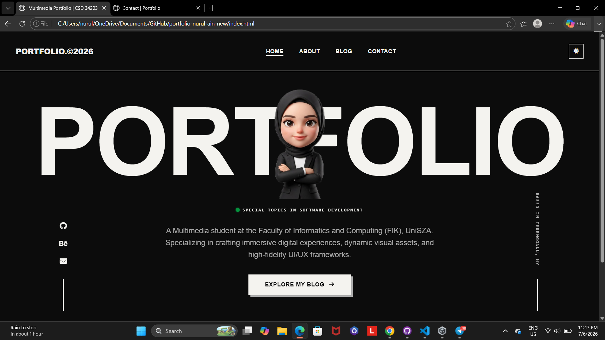 | **1. Mobile Home** <br> 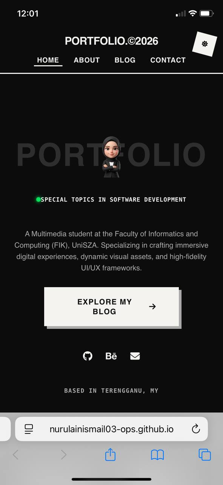 |
| **2. About & Interactive Tabs** <br> 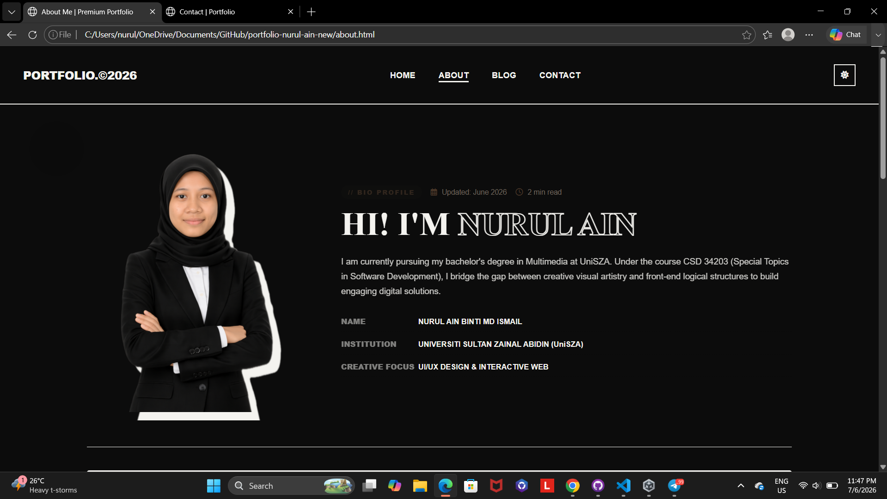 | **2. Mobile About** <br> 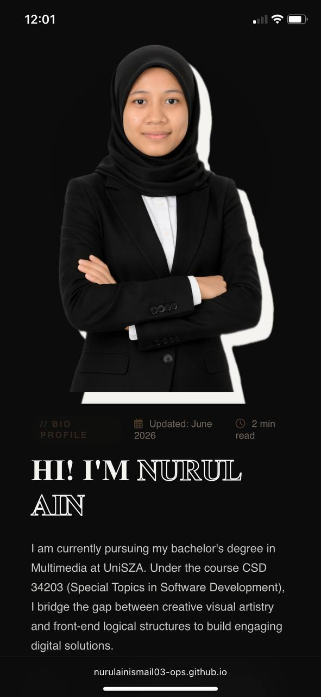 |
| **3. Bento Grid & Timeline** <br> 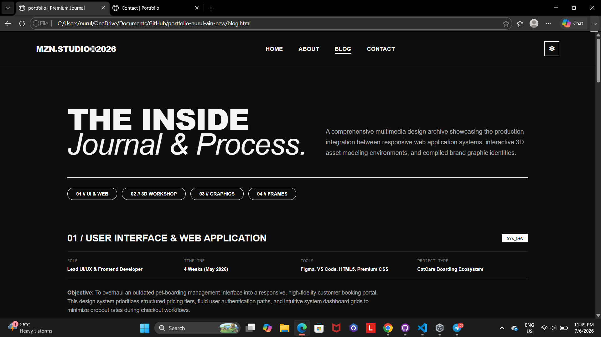 | **3. Mobile Bento & Timeline** <br> 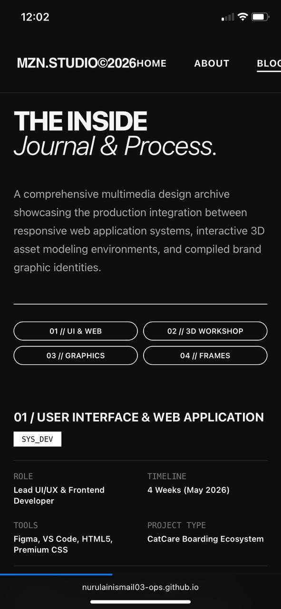 |
| **4. Blog & Contact Page** <br> 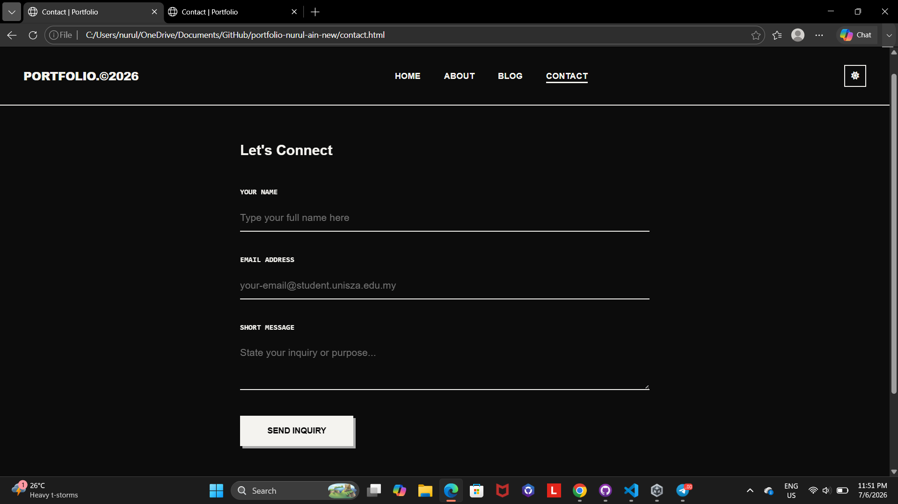 | **4. Mobile Blog & Contact** <br> 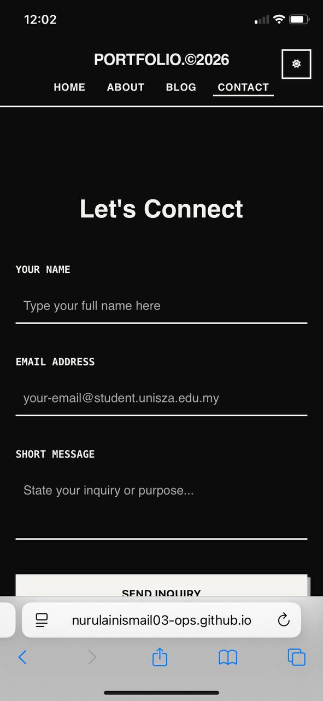 |

</details>

---

### ⚪ Light Theme View (Versi Cerah)
<details>
<summary><b>Click to Expand / Collapse Light Theme Screenshots</b></summary>
<br>

| Desktop View (Cerah) | Mobile View (Cerah) |
| :---: | :---: |
| **1. Home Page** <br> 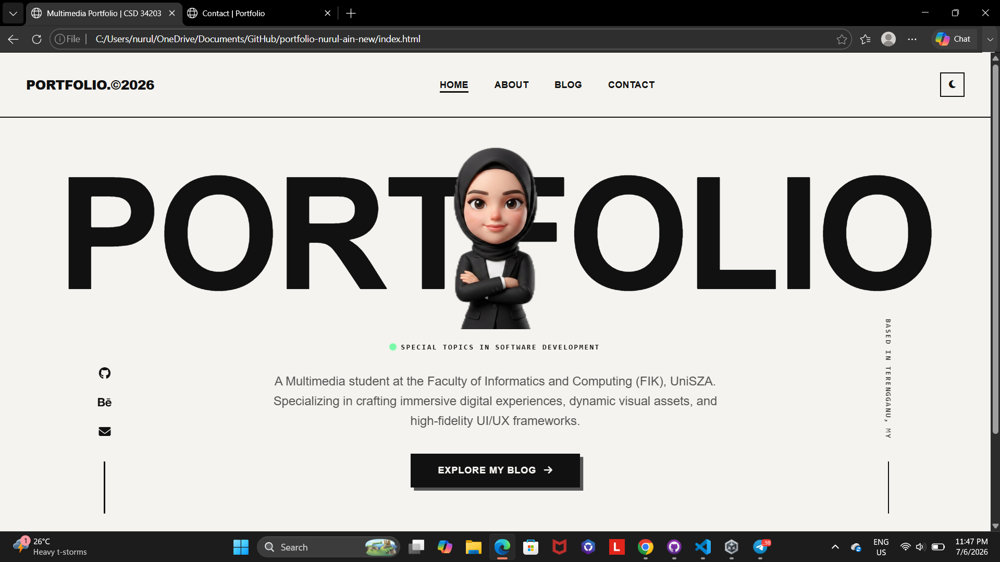 | **1. Mobile Home** <br> 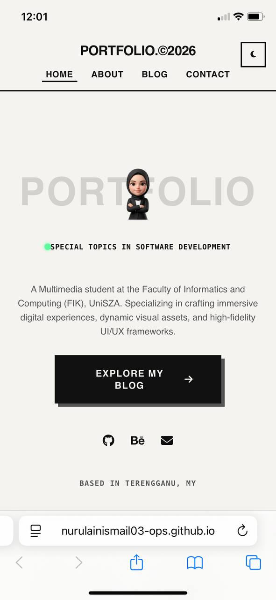 |
| **2. About & Interactive Tabs** <br> 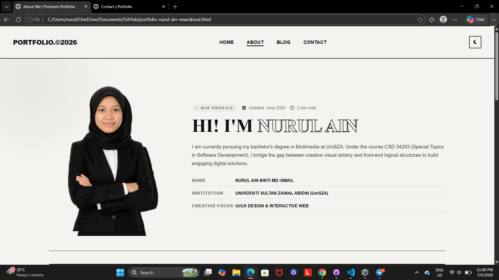 | **2. Mobile About** <br> 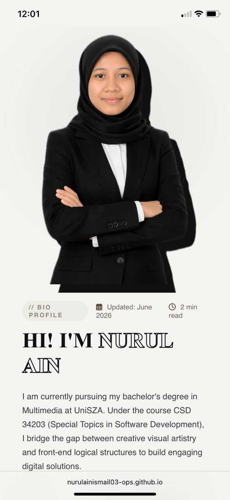 |
| **3. Bento Grid & Timeline** <br> 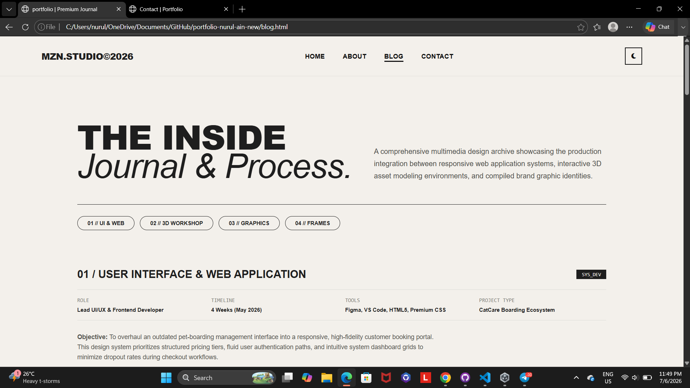 | **3. Mobile Bento & Timeline** <br> 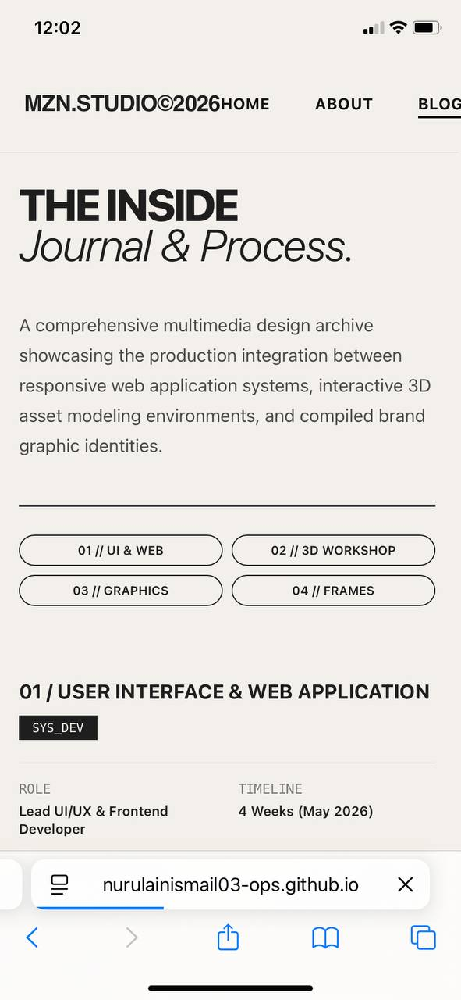 |
| **4. Blog & Contact Page** <br> 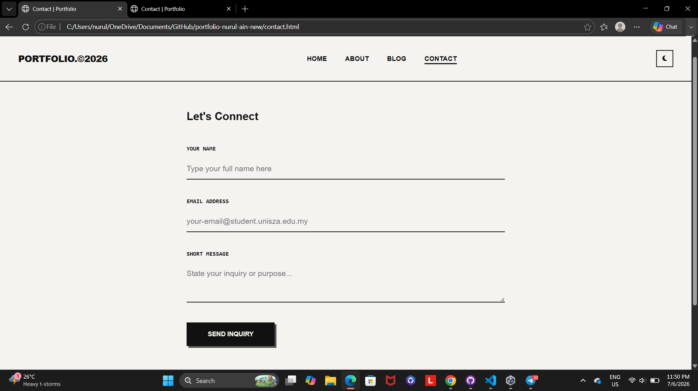 | **4. Mobile Blog & Contact** <br> 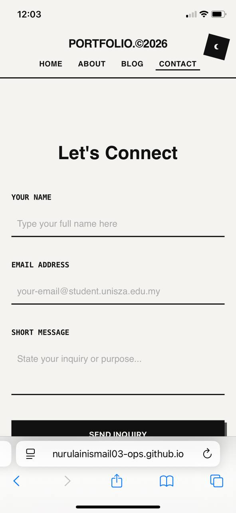 |

</details>

---

## Demo Link
* **🔗 Live Website Link:** [Click Here to View Live Portfolio](https://nurulainismail03-ops.github.io/portfolio-nurul-ain-new/)
* **📂 Project Repository Link:** [Click Here to View GitHub Repository](https://github.com/nurulainismail03-ops/portfolio-nurul-ain-new)

---

## How to Run the Project
Follow these step-by-step instructions to run the project locally on your machine:

### 1. Prerequisites
Ensure you have a modern web browser installed (such as Google Chrome, Mozilla Firefox, Microsoft Edge, or Safari). Git should also be installed on your system if you wish to clone the repository via terminal.

### 2. Clone the Repository
Open your terminal, command prompt, or Git Bash, and run the following command to clone the project:
```bash
git clone [https://github.com/nurulainismail03-ops/portfolio-nurul-ain-new.git](https://github.com/nurulainismail03-ops/portfolio-nurul-ain-new.git).
